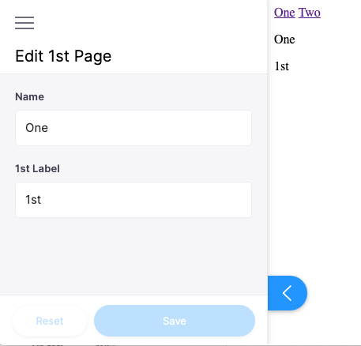
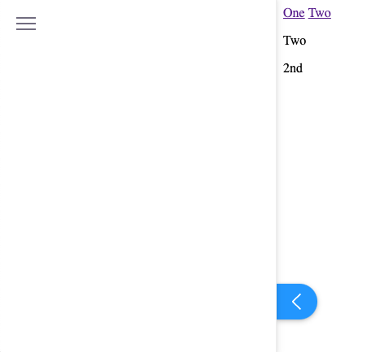
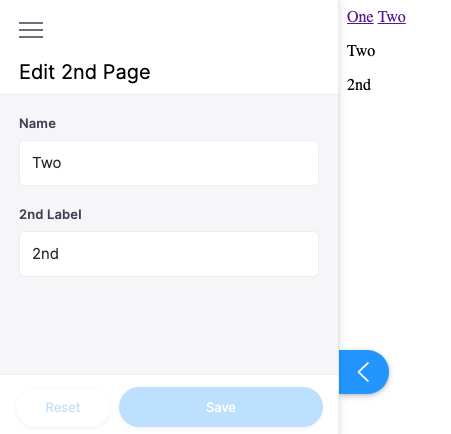
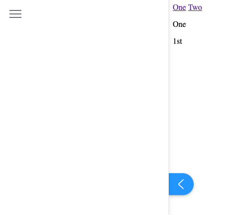

Steps to reproduce error.
- Install packages: `yarn`
- Run project: `yarn dev`
- Visit page 1: `localhost:8000/one`
- Open TinaCMS editor - the form is present:

- Click on link "Two" in order to open second page - the form is empty

- Reload the page by pressing `Ctrl+R` (or `Cmd+R` on mac)
- Now page Two has form:

- Click on link "One", the first page doesn't have form:

